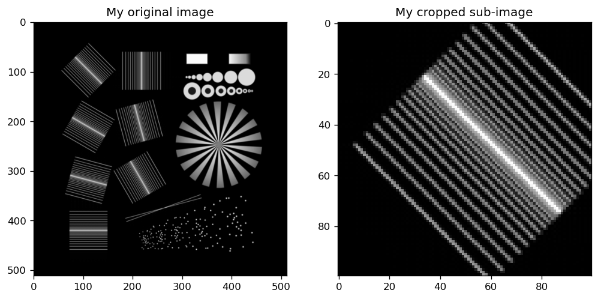
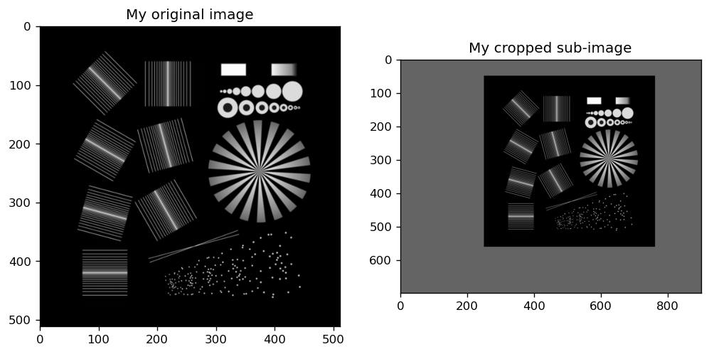

# Tutorial 2 

## Helper functions


We continue the tutorial with a set of helpful functions, which you can use in your everyday life. 

We assume you have imported the toolbox

```py
import NanoImagingPack as nip
```


### Extracting, Padding and Cropping

First of all, we want to present you the ```extract``` function. This is one of the most useful functions in the NIP toolbox (in my opinion). In short: 
*```Extract``` will crop/pad an input ```image``` around the ```centerpos```ition with the a ```size```. This could mean, that the values are cropped or expanded. Datatypes are preserved.*

The docstring by typing ```nip.extract??``` gives you the following details:

```py 
Signature:
nip.extract(
    img,
    ROIsize=None,
    centerpos=None,
    PadValue=0.0,
    checkComplex=True,
)
Source:   
def extract(img, ROIsize=None, centerpos=None, PadValue=0.0, checkComplex=True):
    '''
    EXTRACT a part in an n-dimensional array based on stating the destination ROI size and center in the source
    :param img: Input image
    :param ROIsize: region of interest to extract ((minx,maxx),(miny,maxy))
    :param centerpos: center of the ROI in source image to extract
    :param PadValue: Value to assign to the padded area. If PadValue==None, no padding is performed and the non-existing regions are pruned.
    :param checkComplex: ToDO: What is this used for?
    :return: an extracted image

    Example1:
    import NanoImagingPack as nip
    im = nip.readim()
    im.extract([128,128]) #EXTRACT an ROI of 128*128 from centre of image

    Example1:
    import NanoImagingPack as nip
    im = nip.readim()
    im.extract([128,128],[128,128]) #EXTRACT an ROI of 128*128 with coordinate 128,128 as centre

    ToDO: The example below by Rainer doesn't work becasue there is no function centered_extract?

    '''
    """
        extracts a part in an n-dimensional array based on stating the destination ROI size and center in the source

        ROIsize: size of the ROI to extract. Will automatically be limited by the array sizes when applied. If ROIsize==None the original size is used
        centerpos: center of the ROI in source image to exatract
        PadValue (default=0) : Value to assign to the padded area. If PadValue==None, no padding is performed and the non-existing regions are pruned.

        Example:
        
            nip.centered_extract(nip.readim(),[799,799],[-1,-1],100) # extracts the right bottom quarter of the image

        RH Version
    """
    if checkComplex:
        if np.iscomplexobj(img):
            raise ValueError(
                "Found complex-valued input image. For Fourier-space extraction use extractFt, which handles the borders or use checkComplex=False as an argument to this function")

    mysize = img.shape

    if ROIsize is None:
        ROIsize = mysize
    else:
        ROIsize = util.expanddimvec(ROIsize, len(mysize), mysize)

    mycenter = [sd // 2 for sd in mysize]
    if centerpos is None:
        centerpos = mycenter
    else:
        centerpos = util.coordsToPos(util.expanddimvec(centerpos, img.ndim, othersizes=mycenter), mysize)

    #    print(ROIcoords(centerpos,ROIsize,img.ndim))
    res = img[util.ROIcoords(centerpos, ROIsize, img.ndim)]
    if PadValue is None:
        return res
    else:  # perform padding
        pads = [(max(0, ROIsize[d] // 2 - centerpos[d]), max(0, centerpos[d] + ROIsize[d] - mysize[d] - ROIsize[d] // 2)) for d in range(img.ndim)]
        #        print(pads)
        resF = np.pad(res, tuple(pads), 'constant', constant_values=PadValue)
        resF = resF.view(image)
        resF.__array_finalize__(res)  # will copy information such as pixelsize from "res"
        return resF
File:      /opt/anaconda3/envs/tfcpu2/lib/python3.7/site-packages/NanoImagingPack/image.py
Type:      function
```

#### Cutting out a sub-roi

If you simply want to extract a sub region of your image, you can do that by typing the following:

```py
import NanoImagingPack as nip
import matplotlib.pyplot as plt

myimage = nip.readim()
mysize = (100,100)
mypos = (100,100)

# Here we crop the image:
myimage_cropped = nip.extract(myimage, mysize, mypos)


# The image will be cut out with a box (100x100 pixels) around the center position (100,100)
plt.subplot(121), plt.title('My original image'), plt.imshow(myimage)
plt.subplot(122), plt.title('My cropped sub-image'), plt.imshow(myimage_cropped)
```

It will give you the following result:

<p align="center">
<a href="#logo" name="logo"></a>
</p>


#### Padding an image

If you want to pad an image with some values you could of course use the ```np.pad``` function. But what if you want to pad it with a non-homogenous margin around the image? You can do the following:


```py
import NanoImagingPack as nip
import matplotlib.pyplot as plt

myimage = nip.readim()
mysize = (700,900)
mypos = (300,200)

# Here we crop the image:
myimage_cropped = nip.extract(myimage, mysize, mypos, PadValue=100)


# The image will be cut out with a box (100x100 pixels) around the center position (100,100)
plt.subplot(121), plt.title('My original image'), plt.imshow(myimage, cmap='gray')
plt.subplot(122), plt.title('My cropped sub-image'), plt.imshow(myimage_cropped, cmap='gray')
```

It will give you the following result:

<p align="center">
<a href="#logo" name="logo"></a>
</p>

The newly created image has the whole original image centered at ```700,900``` and an added padding with a value of 100. 

It works in N-dimensions. So you can do the same with a stack of images, where size and center have to be vectors with three entries respectively. 


#### Extracting complex valued arrays

As mentioned previously, the ```nip.extract()``` method preserves datatypes. This is especially true for complex-valued tensors. 

```py
import NanoImagingPack as nip
import matplotlib.pyplot as plt

# Create a complex valued image
myimage = nip.readim()+1j * nip.readim()
mysize = (700,900)
mypos = (300,200)

fta = nip.ft(myimage)
fta.shape
Out[9]: (512, 512)
nip.extract(fta,[100,100])
```

You may encounter an error which says: 

```
File "c:\users\pi96doc\documents\programming\pythonscripts\fromweb\nanoimagingpack\NanoImagingPack\image.py", line 1943, in extract
    "Found complex-valued input image. For Fourier-space extraction use extractFt, which handles the borders or use checkComplex=False as an argument to this function")
ValueError: Found complex-valued input image. For Fourier-space extraction use extractFt, which handles the borders or use checkComplex=False as an argument to this function
fta2=nip.extract(fta,[fta.shape[0],fta.shape[1]*2], checkComplex=False)
```

This is hinting you to the fact, that in case you crop a spectrum. Therfore, there is a special function which makes sure, that values at the edge on images with even pixel numbers will be handled correctly:

```py
import NanoImagingPack as nip
import numpy as np
a = nip.readim()
sz = a.shape
nsz=[sz[0],sz[1]*2]
stretched1 = nip.ift(nip.extract(nip.ft(a),nsz,checkComplex=False))
print(np.min(np.imag(stretched1)))  # Problem, due to the umatching Fourier line
stretched2 = nip.ift(nip.extractFt(nip.ft(a),nsz))
print(np.min(np.imag(stretched2)))  # No problem, due to the umatching Fourier line
unstretched = nip.ift(nip.extractFt(nip.ft(stretched2),sz))
print(np.min(np.imag(unstretched))) # No problem, due to the umatching Fourier line

a = nip.readim()
sz = a.shape
nsz = [sz[0], sz[1] * 2]
fta = nip.ft(a)
fta2 = nip.extract(fta, nsz, checkComplex=False)
stretched1 = nip.ift(fta2)
print(np.min(np.imag(stretched1)))  # Problem, due to the umatching Fourier line
stretched2 = nip.ift(nip.fixFtAfterExtract(fta2, fta, ignoredim=None))
print(np.min(np.imag(stretched2)))  # No problem, due to the umatching Fourier line
```


### Apply a Gaussian filter to your image

```py
nip.gaussf()
```


### Norm of FFTs in NIP


Let's have a look at the documentation of the ```nip.ft``` again:

```py
nip.ft?
Signature:
nip.ft(
    im,
    shift_after=True,
    shift_before=True,
    ret='complex',
    axes=None,
    s=None,
    norm='ortho',
)
Docstring:
Fouriertransform of image
M - Incomming matrix
shift -shift AFTER transformation? (True, False, 'DEFAULT')
shift_before - shift BEFORE transformation (True, False, 'DEFAULT')
ret - What to return
        (string values: complex , abs , phase, real, imag, 'DEFAULT')
axes - axes over which to compute the FT -> give as tupel, list or int
            e.g. axes = (0,2) computes over axes 0 and 2
s - Shape (length of each transformed axis) of the output (s[0] referes to axis 0, s[1] to axis 1 etc.)
    Along any axis if the given shape is smaller than tht of the input the input is cropped, if larger its padded with zeros
    If not given, the shape of the input axes specified by axes is used
norm: Normalization mode, None or 'ortho' or 'DEFAULT' . Refer to np.fft help for further information
        None:
            IFT and FT scale differently
            value at zero frequency contains number of photons in the image. Can then be used as OTF
        'ortho' (default)
            IFT and FT scale identical
            Value at zero freq. gives sqrt(number photons ) (check!!!)
File:      c:\users\pi96doc\documents\programming\pythonscripts\fromweb\nanoimagingpack\nanoimagingpack\transformations.py
```


In comparison to the numpy version of the ```fft```:

```py
np.fft.fft?
Signature: np.fft.fft(a, n=None, axis=-1, norm=None)
Docstring:
Compute the one-dimensional discrete Fourier Transform.
This function computes the one-dimensional *n*-point discrete Fourier
Transform (DFT) with the efficient Fast Fourier Transform (FFT)
algorithm [CT].
Parameters
----------
a : array_like
    Input array, can be complex.
n : int, optional
    Length of the transformed axis of the output.
    If `n` is smaller than the length of the input, the input is cropped.
    If it is larger, the input is padded with zeros.  If `n` is not given,
    the length of the input along the axis specified by `axis` is used.
axis : int, optional
    Axis over which to compute the FFT.  If not given, the last axis is
    used.
norm : {None, "ortho"}, optional
    .. versionadded:: 1.10.0
    Normalization mode (see `numpy.fft`). Default is None.
Returns
-------
out : complex ndarray
    The truncated or zero-padded input, transformed along the axis
    indicated by `axis`, or the last one if `axis` is not specified.
Raises
------
IndexError
    if `axes` is larger than the last axis of `a`.
See Also
--------
numpy.fft : for definition of the DFT and conventions used.
ifft : The inverse of `fft`.
fft2 : The two-dimensional FFT.
fftn : The *n*-dimensional FFT.
rfftn : The *n*-dimensional FFT of real input.
fftfreq : Frequency bins for given FFT parameters.
Notes
-----
FFT (Fast Fourier Transform) refers to a way the discrete Fourier
Transform (DFT) can be calculated efficiently, by using symmetries in the
calculated terms.  The symmetry is highest when `n` is a power of 2, and
the transform is therefore most efficient for these sizes.
The DFT is defined, with the conventions used in this implementation, in
the documentation for the `numpy.fft` module.
References
----------
.. [CT] Cooley, James W., and John W. Tukey, 1965, "An algorithm for the
        machine calculation of complex Fourier series," *Math. Comput.*
        19: 297-301.
Examples
--------
 np.fft.fft(np.exp(2j * np.pi * np.arange(8) / 8))
array([-2.33486982e-16+1.14423775e-17j,  8.00000000e+00-1.25557246e-15j,
        2.33486982e-16+2.33486982e-16j,  0.00000000e+00+1.22464680e-16j,
       -1.14423775e-17+2.33486982e-16j,  0.00000000e+00+5.20784380e-16j,
        1.14423775e-17+1.14423775e-17j,  0.00000000e+00+1.22464680e-16j])
In this example, real input has an FFT which is Hermitian, i.e., symmetric
in the real part and anti-symmetric in the imaginary part, as described in
the `numpy.fft` documentation:
 import matplotlib.pyplot as plt
 t = np.arange(256)
 sp = np.fft.fft(np.sin(t))
 freq = np.fft.fftfreq(t.shape[-1])
 plt.plot(freq, sp.real, freq, sp.imag)
[<matplotlib.lines.Line2D object at 0x...>, <matplotlib.lines.Line2D object at 0x...>]
 plt.show()
File:      c:\users\pi96doc\.conda\envs\inversemodeling37\lib\site-packages\numpy\fft\_pocketfft.py
Type:      function
```


Let's compare the ```NIP```and ```NUMPY```version of the two Fourier transforms:


```py
# Read the image
myimage = nip.readim()

# apply the numpy Fourier transform in 2D
ft_np = np.fft.fft2(myimage)

# apply the NIP Fourier transform in 2D
ft_nip = nip.ft(myimage)


print("The sum of the object is: "+str(np.sum(myimage)))
print("The value of the zeroth frequency using NUMPY is: "+str(ft_np[0,0]))
print("The value of the zeroth frequency using NIP is: "+str(ft_nip[256,256]))
```

The result is given as:

```
The sum of the object is: 5485156
The value of the zeroth frequency using NUMPY is: (5485156+0j)
The value of the zeroth frequency using NIP is: (10713.195312499998+0j)
```

Interestingly, the values differ between NIP and Numpy. The reason can be found in the different normalizations. 

What does this mean for our image processing?

#### Convolution in NIP and numpy

```py
# create an artificial PSF
psf = nip.readim()


# normalize the PSF to have an integral of 1
psf = psf/np.sum(psf)

# perform the convolution as the ift of the product of the two spectra
myresult = nip.ift(nip.ft(myimage) * nip.ft(psf))

# compare the sum of the two matrices and the final result 
np.sum(psf)
# Out[82]: 1.0000000000000002
np.sum(myimage)
# Out[83]: 5485156
np.sum(myresult)
Out[84]: (10713.19531249999-1.5777218104420236e-30j)
```


Now let's consider "proper" normalization, where we use the factor ```np.sqrt(np.prod(myimage.shape))``` as the normalization factor.

```py
myresult2 = nip.ift(nip.ft(myimage) * nip.ft(psf)) * np.sqrt(np.prod(a.shape))
np.sum(myresult2)
# Out[86]: (5485155.999999995-8.077935669463161e-28j)
```

A convolution with plain numpy gives us the following 

```py
myresult_np = np.fft.ifft2(np.fft.fft2(myimage) * np.fft.fft2(psf))
np.sum(myresult_np)
# Out[95]: (5485156+0j)
``` 

So there is a diference in the forward and backwards path of the ```nip``` and ```numpy```-based Fourier transforms. 

```NIP``` scales only its forward path with an additional factor of ```np.sqrt(np.prod(input.shape))```, wheras ```numpy``` doesn't.
As a consequence, the convolution is easier to achieve using ```numpy```.  


