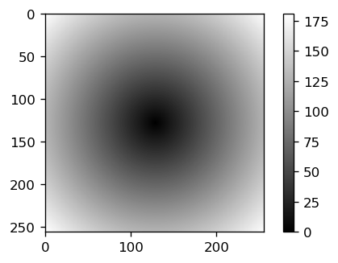
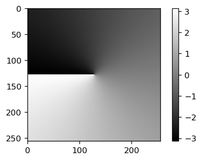

# Tutorial 1 

## Getting Started


First we want to start with some toy-examples. Start by importing the libraries:

``` py
import numpy as np
import NanoImagingPack as nip
```

The output will be something like this:

``` 
Backend Qt5Agg is interactive backend. Turning interactive mode on.
Problem setting classpath. Switching to conventional viewer by setting __DEFAULTS__['IMG_VIEWER'] = 'NIP_VIEW'
``` 

which already indicates, that the default viewer is set to ```NIP_VIEW```. We can change that later. 


### Reading and displaying an image

NIP has an inbuild image reader function which can read N-dimensional data with the help of the bioformats 

```py
myobject = nip.readim()
```

Without setting an argument, a default test image will be read. You can display it with the following command

```py
nip.view(myobject)
```

<p align="center">
<a href="#logo" name="logo"></a>
</p>

The image is a ```NanoImagingPack.image.image```-class object:


```
object.__class__
Out[7]: NanoImagingPack.image.image
```


An alternative to display the image would be the use of the [***NAPARI***](https://napari.org/) image viewer. You can conveniently call it by using the following command:

```
nip.vv(sample)
Out[24]: <napari.viewer.Viewer at 0x1f065bd5748>
```

In case nothing happens or an error occurs, you can try adding the following python magic commad which selects the proper backend: ```%gui qt```. The image opens externally

<p align="center">
<a href="#logo" name="logo"></a>
</p>


#### NIP default viewer 

NIP has a viewer which can adjust the minimum, maximum and gamma value with sliders. You can open it by typing

```py
nip.view(np.log(np.abs(1+np.fft.fft2(nip.readim()))))
```

<p align="center">
<a href="#logo" name="logo"></a>
</p>


## Creator functions

NIP has a number of creator functions which makes life much easier if you for example want to construct a *linear phase mask* or create a circular disk to block certain frequencies. 

You can find following functions: 

```
nip.rr() - creates a ramp in r direction
nip.xx() - creates a ramp in x direction
nip.yy() - creates a ramp in y direction
nip.zz() - creates a ramp in z direction
nip.phiphi() - creates a ramp in phi direction. This does NOT account for the pixel sizes!! Use cosSinTheta instead!
nip.rr2() - creates a square of a ramp in r direction 
```

According to the ```FFT``` Fouriertransforms, the center is defined as 
``` 
center=N//2+1
```

#### Linear Ramps in XX, YY and ZZ

You can create a linear ramp in x, y and z with this function call:
```nip.xx(mysize=(256, 256), placement='center', freq=None, pixelsize=None)```, where ```mysize``` corresponds to the dimension in ```(Nx, Ny, Nz)```, ```placement``` sets the origin (i.e. zero-coordinate) of your ramp function, ```freq='ftfreq', ftradfreq, fftfreq, rfftfreq, fftradfreq or rfftradfreq``` can change the scaling (e.g. ```-Nx//2:0:Nx//2``` or ```-0.5:0:0.5```) 

By typing ```xx?``` you can get the documentation of the function, which will give you this

```py
    """
    creates a ramp in x direction
    standart size is 256 X 256
    placement:
        center: 0 is at cetner
                if x is even, it has one more value in the positve:
                    e.g. size_x = 100 -> goes from -50 to 49
        negative : goes from negative size_x to 0
        positvie : goes from 0 size_x to positive
    """
```

The following code produces a simple 2D ramp - but it can be 1D, 2D or 3D: 


```
import matplotlib.pyplot as plt
plt.imshow(nip.xx(mysize=(256, 256), placement='center', freq='ftfreq'), cmap='gray')
plt.colorbar()
```

<p align="center">
<a href="#logo" name="logo"></a>
</p>

#### Polar Ramps in PhiPhi and RR

You can create a linear phase-ramps in polar coordinates. Very useful for spiral phases or circular masks. 

Now we create a circle using the ```nip.rr```function which first creates a 2D map with pixel values ```r=sqrt(x**2+y**2)```:

```
plt.imshow(nip.rr(mysize=(256, 256), placement='center'), cmap='gray')
plt.colorbar()
```

<p align="center">
<a href="#logo" name="logo"></a>
</p>

Thresholding the ```rr```-function gives us a circle with radius of the threshold:

```
plt.imshow(nip.rr(mysize=(256, 256), placement='center')<64, cmap='gray')
plt.colorbar()
```

<p align="center">
<a href="#logo" name="logo"></a>
</p>

The full doc-string will give you the following information:

```
nip.rr(
    mysize=(256, 256),
    placement='center',
    offset=None,
    scale=None,
    freq=None,
    pixelsize=None,
)

Docstring:
creates a ramp in r direction
standart size is 256 X 256
placement is always "center"
offset -> x/y offset in pixels (number, list or tuple)
scale is tuple, list, none or number of axis scale
File:      c:\users\pi96doc\documents\programming\pythonscripts\fromweb\nanoimagingpack\nanoimagingpack\coordinates.py
Type:      function
a = nip.rr()
   ...:
a
```


Creating a circular phase ramp with a phase-value -pi...pi can be done using the ```nip.phiphi()```-function:

```
plt.imshow(nip.phiphi(mysize=(256, 256), placement='center'), cmap='gray')
plt.colorbar()
```

<p align="center">
<a href="#logo" name="logo"></a>
</p>


## Fourier Transforms

NIP makes your frequency-space life a lot easier, since you don't need to worry about the correct order of shift/back-shift your zero-frequencies. 

The following Fourier-transforming options are available:

```py
Forward Transformation:

nip.ft() - Perform a ND Fourier transform of the first two dimensions only of an arbitrary stack
nip.ft2d() - Perform a 2D Fourier transform of the first two dimensions only of an arbitrary stack
nip.ft3d() - Perform a 3D Fourier transform of the first two dimensions only of an arbitrary stack


inverse Transformation:

nip.ift() - Perform a ND inverse Fourier transform of the first two dimensions only of an arbitrary stack
nip.ift2d() - Perform a 2D inverse Fourier transform of the first two dimensions only of an arbitrary stack
nip.ift3d() - Perform a 3D inverse Fourier transform of the first two dimensions only of an arbitrary stack

real-space FT:

nip.rft()
nip.rft2d()
nip.rft3d()

nip.irft()
nip.irft2d()
nip.irft3d()
```


***ATTENTION:*** Other than in Matlab, the FFT is normalized by an additional division by ```sqrt(prod(totransfor.shape))```! 

#### Display 2D spectrum

Displaying the 2D spectrum of the sample image is as simple as this:

```py
plt.imshow(np.log(np.abs(1+nip.ft(nip.readim()))), cmap='gray')
plt.colorbar()
```

<p align="center">
<a href="#logo" name="logo"></a>
</p>

This is what a lens would produce if we place the transmissive object inside the focal plane of the lens and capture the back focal plane (BFP). Beware, that we plot it in log-scale, otherwise you would not see the large dynamic range of the Fourier transform. 

Compared to the generic FFT from numpy, it shifts all frequency components automatically, such that you can find the zero-pixel in the center. The same code with the numpy FFT looks like that:

```py
plt.imshow(np.log(np.abs(1+np.fft.fft2(nip.readim()))), cmap='gray')
plt.colorbar()
```

<p align="center">
<a href="#logo" name="logo"></a>
</p>

The zero-frequency can be found at the ```(0,0)``` coordinate. 


#### Filter the 2D spectrum and "image"

Now we want to apply a low-pass filter to the spectram and filter all the higher information out. Therefore we multiply the spectrum with the disc we created earlier and perform an inverse Fourier transform as 

```py
myobject = nip.readim()
disk = nip.rr(mysize= myobject.shape, placement='center')<64
myspectrum = nip.ft2d(myobject)
myspectrum_filtred = myspectrum*disk
myimage = np.real(nip.ift2d(myspectrum_filtred))

# display original and filtered object/image
plt.subplot(121), plt.title('original object')
plt.imshow(myobject, cmap='gray')
plt.colorbar()

plt.subplot(122), plt.title('filtered image')
plt.imshow(myimage, cmap='gray')
plt.colorbar()
```


<p align="center">
<a href="#logo" name="logo"></a>
</p>


You can see that some of the smaller detailes are lost since they are blocked by the cirucular aperture you just created. 

